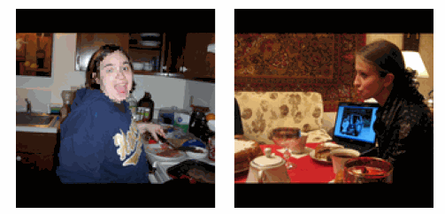

# A Tale of Two Features: Stable Diffusion Complements DINO for Zero-Shot Semantic Correspondence

**A Tale of Two Features** explores the complementary nature of Stable Diffusion (SD) and DINOv2 features for zero-shot semantic correspondence. The results demonstrate that a simple fusion of the two features leads to state-of-the-art performance on the SPair-71k, PF-Pascal, and TSS datasets.

This repository is the official implementation of the paper:

[**A Tale of Two Features: Stable Diffusion Complements DINO for Zero-Shot Semantic Correspondence**](https://arxiv.org/abs/2305.15347)
[*Junyi Zhang*](https://junyi42.github.io/),
[*Charles Herrmann*](https://scholar.google.com/citations?user=LQvi5XAAAAAJ),
[*Junhwa Hur*](https://hurjunhwa.github.io/),
[*Luisa F. Polanía*](https://scholar.google.com/citations?user=HGLobX4AAAAJ),
[*Varun Jampani*](https://varunjampani.github.io/),
[*Deqing Sun*](https://deqings.github.io/),
[*Ming-Hsuan Yang*](https://faculty.ucmerced.edu/mhyang/)
NeurIPS, 2023.


## Visual Results
### Dense Correspondence


### Object Swapping
<div align="center">


</div>
<div align="center">


</div>
<div align="center">



</div>

### Object Swapping (with refinement process)
<div align="center">


</div>

## Links
* [Project Page](https://sd-complements-dino.github.io) (with additional visual results)
* [arXiv Page](https://arxiv.org/abs/2305.15347)

## Environment Setup

To install the required dependencies, use the following commands:

```bash
conda create -n sd-dino python=3.9
conda activate sd-dino
conda install pytorch=1.13.1 torchvision=0.14.1 pytorch-cuda=11.6 -c pytorch -c nvidia
conda install -c "nvidia/label/cuda-11.6.1" libcusolver-dev
git clone git@github.com:Junyi42/sd-dino.git 
cd sd-dino
pip install -e .
```
(Optional) You may also want to install [xformers](https://github.com/facebookresearch/xformers) for efficient transformer implementation:

```
pip install xformers==0.0.16
```

## Get Started

### Prepare the data

We provide the scripts to download the datasets in the `data` folder. To download specific datasets, use the following commands:

* SPair-71k: 
```bash
bash data/prepare_spair.sh
```
* PF-Pascal: 
```bash
bash data/prepare_pfpascal.sh
```
* TSS: 
```bash
bash data/prepare_tss.sh
```

### Evaluate the PCK Results of SPair-71k


Run [pck_spair_pascal.py](pck_spair_pascal.py) file: 

```bash
python pck_spair_pascal.py --SAMPLE 20
```

Note that the `SAMPLE` is the number of sampled pairs for each category, which is set to 20 by default. Set to `0` to use all the samples (settings in the paper).

Additional important parameters in [pck_spair_pascal.py](pck_spair_pascal.py) include:

* `--NOT_FUSE`: if set to True, only use the SD feature.
* `--ONLY_DINO`: if set to True, only use the DINO feature.
* `--DRAW_DENSE`: if set to True, draw the dense correspondence map.
* `--DRAW_SWAP`: if set to True, draw the object swapping result.
* `--DRAW_GIF`: if set to True, draw the object swapping result as a gif.
* `--TOTAL_SAVE_RESULT`: number of samples to save the qualitative results, set to 0 to disable and accelerate the evaluation process.

Please refer to the [pck_spair_pascal.py](pck_spair_pascal.py) file for more details. You may find samples of qualitative results in the `results_spair` folder.

### Evaluate the PCK Results of PF-Pascal

Run [pck_spair_pascal.py](pck_spair_pascal.py) file: 

```bash
python pck_spair_pascal.py --PASCAL
```

You may find samples of qualitative results in the `results_pascal` folder.

### Evaluate the PCK Results of TSS

Run [pck_tss.py](pck_tss.py) file: 

```bash
python pck_tss.py
```

You may find samples of qualitative results in the `results_tss` folder.

## Demo

### PCA / K-means Visualization of the Features

To extract the fused features of the input pair images and visualize the correspondence,
please check the notebook [demo_vis_features.ipynb](demo_vis_features.ipynb) for more details.

### Quick Try on the Object Swapping

To swap the objects in the input pair images, please check the notebook [demo_swap.ipynb](demo_swap.ipynb) for more details.

### Refine the Result

TODO

## Citation

If you find our work useful, please cite:

```BiBTeX
@article{zhang2023tale,
  title={{A Tale of Two Features: Stable Diffusion Complements DINO for Zero-Shot Semantic Correspondence}},
  author={Zhang, Junyi and Herrmann, Charles and Hur, Junhwa and Cabrera, Luisa Polania and Jampani, Varun and Sun, Deqing and Yang, Ming-Hsuan},
  journal={arXiv preprint arxiv:2305.15347},
  year={2023}
}
```

## Acknowledgement

Our code is largely based on the following open-source projects: [ODISE](https://github.com/NVlabs/ODISE), [dino-vit-features (official implementation)](https://github.com/ShirAmir/dino-vit-features), [dino-vit-features (Kamal Gupta's implementation)](https://github.com/kampta/dino-vit-features), [DenseMatching](https://github.com/PruneTruong/DenseMatching), and [ncnet](https://github.com/ignacio-rocco/ncnet). Our heartfelt gratitude goes to the developers of these resources!
